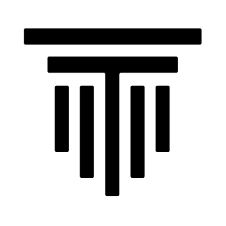

<h2 align="center">
  Send and Receive with Telestai's web wallet.
</h2>

---

 

## Be your own Bank

Telestai-Web-Wallet is a completely [non-custodial](https://www.bitcoin.com/get-started/custodial-non-custodial-bitcoin-wallets/), client-side system, giving you absolute control over your funds, data, bandwidth and privacy... all of which are essential to easily-attainable **self-sovereignty**.

 

---

 

## Universal and Portable

Telestai-Web-Wallet is completely universal and portable, at both a user-experience level & protocol-level, this app is interopable with much of the functionality within Telestai, while also being portable enough to run on almost **any device in the world**.

 

---

 

## Don't trust, Verify!

Telestai-Web-Wallet is completely free, open-source software ([FOSS](https://en.wikipedia.org/wiki/Free_and_open-source_software)), with absolute transparency in security, features, down to every letter of code.

 

---

 

## By the Community, for the Community

The app is built by [Telestai](https://github.com/Telestai-Project) and AIPG developers, tech  [awesome people](https://github.com/Telestai-Project) that build both FOSS and Proprietary software for the TLS community to enjoy.

The mission of Telestai is to accelerate the adoption & growth of TLS as a currency, using awesomeness. Join the [Telestai Discord](https://discord.gg/VmFXfHnZE5) to meet us!

